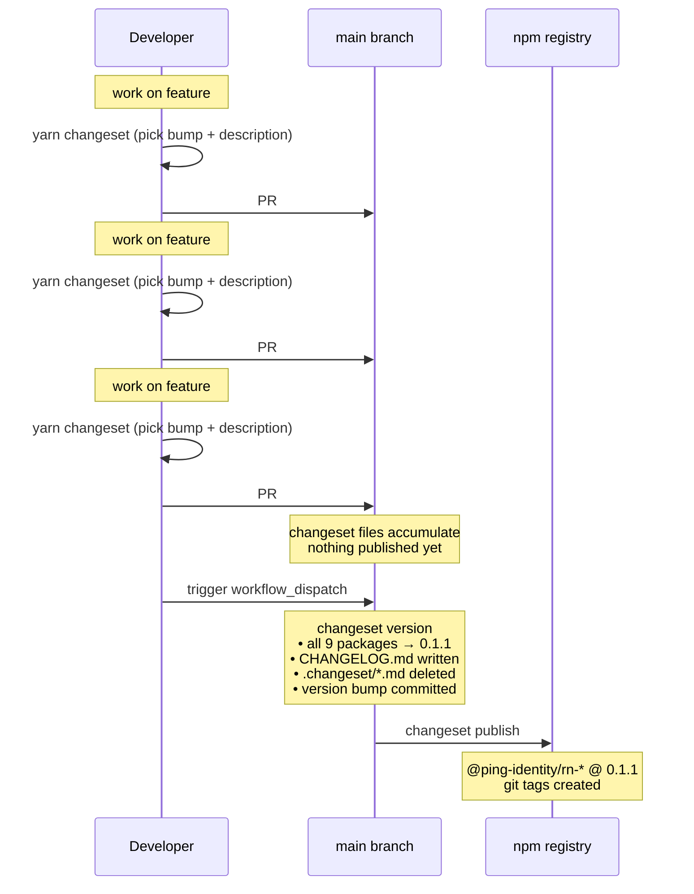

<!--
Copyright (c) 2026 Ping Identity Corporation. All rights reserved.

This software may be modified and distributed under the terms
of the MIT license. See the LICENSE file for details.
-->

# Contributing

Thanks for contributing to the React Native Ping SDK monorepo.

We appreciate feedback and contributions to this repository.

For team standards and best practices, please refer to our [SDK Standards of Practice](https://github.com/ForgeRock/sdk-standards-of-practice/tree/main).

## Development Workflow

This project is a monorepo managed using [Yarn workspaces](https://yarnpkg.com/features/workspaces). It contains:

- SDK packages in `packages/*`.
- A sample app in `PingSampleApp/`.

To get started with the project, run Yarn in the root directory to install dependencies for all workspaces:

```sh
yarn install
```

Since the project relies on Yarn workspaces, do not use `npm` for development workflows.

The sample app in `PingSampleApp/` demonstrates usage of the SDK packages. You should run it to validate changes.

It is configured to use local workspace packages. JavaScript/TypeScript changes are reflected through Metro, while native Android/iOS changes require rebuilding the sample app.

If you want to use native IDEs:

- Open `PingSampleApp/android` in Android Studio.
- Open `PingSampleApp/ios` in Xcode.

You can use the following commands from the root directory.

To start Metro:

```sh
yarn workspace PingSampleApp run start
```

To run the sample app on Android:

```sh
yarn sample:run:android
```

To run the sample app on iOS:

```sh
yarn sample:run:ios
```

Make sure your code passes TypeScript and ESLint checks:

```sh
yarn typecheck
yarn lint
```

To fix formatting/lint errors:

```sh
yarn lint --fix
```

Remember to add tests for your change when possible. Run relevant unit tests by:

```sh
yarn test:browser
yarn test:oidc
yarn test:logger
yarn test:storage
```

### Scripts

The root `package.json` contains scripts for common tasks:

- `yarn install`: install workspace dependencies.
- `yarn typecheck`: run TypeScript checks across all packages.
- `yarn lint`: run ESLint across all packages.
- `yarn lint --fix`: auto-fix lint and formatting errors.
- `yarn packages:build`: build all workspaces in topological order.
- `yarn sample:run:android`: run the sample app on Android.
- `yarn sample:run:ios`: run the sample app on iOS.
- `yarn sample:clean-install`: clean and reinstall sample app dependencies.
- `yarn sample:restart:metro`: restart Metro with reset cache.
- `yarn test:browser`: run browser package tests.
- `yarn test:oidc`: run OIDC package tests.
- `yarn test:logger`: run logger package tests.
- `yarn test:storage`: run storage package tests.
- `yarn test:device-id`: run device-id package tests.
- `yarn test:device-profile`: run device-profile package tests.

### Release Process

This repo uses [Changesets](https://github.com/changesets/changesets) for versioning and publishing. All 9 `@ping-identity/*` SDK packages are versioned and published together (lockstep) on every release.

#### How it works



#### Every PR must include a changeset file

Before opening a PR, run:

```sh
yarn changeset
```

The CLI will prompt you to select a bump type (`patch`, `minor`, or `major`) and write a short description of your change. This creates a `.changeset/xyz.md` file — commit it with your PR.

The changeset description becomes the entry in each package's `CHANGELOG.md` on the next release, linked to your PR and commit SHA. CI will fail if no changeset file is present.

**Bump type guidance:**

- `patch` — bug fixes, non-breaking internal changes
- `minor` — new backwards-compatible features
- `major` — breaking API changes

If your PR does not affect any published package (e.g. CI config changes, documentation edits, test-only changes), run:

```sh
yarn changeset --empty
```

This creates a changeset file with no version bump, satisfying the CI check without affecting the next release version.

#### Releases are triggered manually

Releases do **not** happen automatically on merge. Changeset files accumulate in `.changeset/` until a maintainer is ready to ship.

To release, trigger the [Release workflow](../../actions/workflows/release.yml) via `workflow_dispatch` in GitHub Actions. It will:

1. Bump all 9 packages to the same next version
2. Write `CHANGELOG.md` entries from accumulated changeset files
3. Commit the version bump to `main`
4. Publish to npm
5. Create git tags

**Why `workflow_dispatch` instead of the Changesets bot?**
We deliberately chose manual `workflow_dispatch` instead of the Changesets GitHub bot because:

- This is an early-stage SDK where releases should be deliberate, not automatic
- It avoids a permanently-open "Release PR" that creates pressure to ship before the team is ready
- One explicit button-push makes the release boundary clear

We can adopt the bot pattern later once release cadence is established.

#### Checking release status

To see what version would be released from current pending changesets:

```sh
yarn release:status
```

To verify all packages are at the same version (catches accidental manual edits):

```sh
yarn release:check-lockstep
```

### Sending A Pull Request

When you are sending a pull request:

- Prefer small pull requests focused on one change.
- Verify that lint and relevant tests are passing.
- Review the documentation to make sure it is accurate.
- Follow the pull request template when opening a pull request.
- For pull requests that change API or implementation behavior, discuss with maintainers first by opening an issue.
- Do not modify Gradle version settings without explicit approval.
- Avoid adding new dependencies unless explicitly requested.
